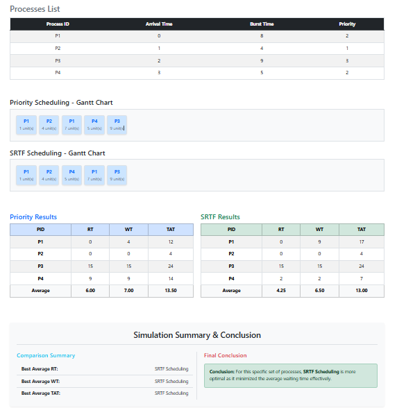

# Scenario A: Preemption and Priority Comparison
## 1- Overview:
This scenario tests the Preemption capability of both algorithms. It specifically examines how the system handles a situation where a new process with a higher priority (or shorter remaining time) arrives while another process is already executing.

## 2-Input data

Based on the simulation results, the following processes were used:

| Process | Arrival Time (AT) | Burst Time (BT)  |Priority |
| :---- | :--- | :--- | :--- | 
| P1 | 0 ms | 8 ms | 2 |
| P2 | 1 ms | 4 ms | 1 |
| P3 | 2 ms | 9 ms | 3 |
| P4 | 3 ms | 5 ms | 2 |

 ## 3-What Happened?

 ### Step 1: Arrival of P1 (Time = 0 ms)
 
 - At T = 0 ms: P1 is the only process in the queue, so it starts running immediately

   ### Step 2: Preemption by P2 (Time = 1 ms)
   
 - At T = 1 ms: P2 arrives and Preempts P1. This happens because:
 -     In Priority: P2 has a higher priority (1) than P1 (2)
 -     In SRTF: P2 has a shorter burst time (4) than P1's remaining time (7)
   

   ### Step 3: P2 Completion & Scheduler Decision (Time = 5 ms)
   - P2 finishes its execution.
   - The scheduler now has three processes waiting: P1 (7 ms left), P3 (9 ms), and P4 (5 ms).
   - In Priority: The CPU resumes P1 because its priority (2) is better than P3 (3) and P4 (4).
   - In SRTF: The CPU starts P4 because its remaining time (5 ms) is shorter than P1 (7 ms) and P3       (9 ms).
     
  ### Step 4: Completion of Remaining Processes 
  - Remaining Sequence: After the chosen process finishes, the scheduler continues to pick the      next best candidate until the Ready Queue is empty.
  - Final Order (Priority): $P2 \rightarrow P1 \rightarrow P3 \rightarrow P4$
  - Final Order (SRTF): $P2 \rightarrow P4 \rightarrow P1 \rightarrow P3$

 ## 4- Manual Calculation (Sample for P1):
  To verify the code results, we calculate the metrics for **P1** manually:
  ### In Priority Scheduling:
  
  - Completion Time (CT): 12 ms
  - Turnaround Time (TAT): CT - AT = 12 - 0 = 12 ms
  - Waiting Time (WT): TAT - BT = 12 - 8 = 4 ms
  - Response Time (RT): First Start - AT = 0 - 0 = 0 ms

   #### In SRTF Scheduling:
   - P1 is preempted at T=1, but at T=5, it stays waiting because P4 is shorter. P1 resumes at T=10.
   - Completion Time (CT): 17 ms
   - TAT (CT - AT): 17 - 0 = 17 ms
   - WT (TAT - BT): 17 - 8 = 9 ms
   - RT: First Start - AT = 0 - 0 = 0 ms

     ## 5-Detailed Results Table:
     ### Priority Scheduling (Preemptive)
     | Process | AT | CT | TAT (CT-AT) | WT (TAT-BT) | RT |
     | :--- | :---: | :---: | :---: | :---: | :---: |
     | P1 | 0 | 12 | 12 | 4 | 0 |
     | P2 | 1 | 5 | 4 | 0 | 0 |
     | P3 | 2 | 21 | 19 | 10 | 10 |
     | P4 | 3 | 26 | 23 | 18 | 18 |

     ### SRTF Scheduling
     | Process | AT | CT | TAT (CT-AT) | WT (TAT-BT) | RT |
     | :--- | :---: | :---: | :---: | :---: | :---: |
     | P1 | 0 | 17 | 17 | 9 | 0 |
     | P2 | 1 | 5 | 4 | 0 | 0 |
     | P3 | 2 | 26 | 24 | 15 | 15 |
     | P4 | 3 | 10 | 7 | 2 | 2 |

     ## 6-Results Summary (Averages):
     | Metric | Priority Scheduling | SRTF Scheduling |
     | :--- | :---: | :---: |
     | Avg Waiting Time | 8.00 ms | 6.50 ms |
     | **Avg Turnaround Time** | 14.50 ms | 13.00 ms |
     | **Avg Response Time** | 7.00 ms | 4.25 ms |

     ## 7-Conclusion
     SRTF performed better in this scenario with a lower Average Waiting Time (**6.50 ms**). The difference in P1's waiting time (4ms vs 9ms) shows how SRTF prioritize shorter tasks over the original process

     
   
    
   
