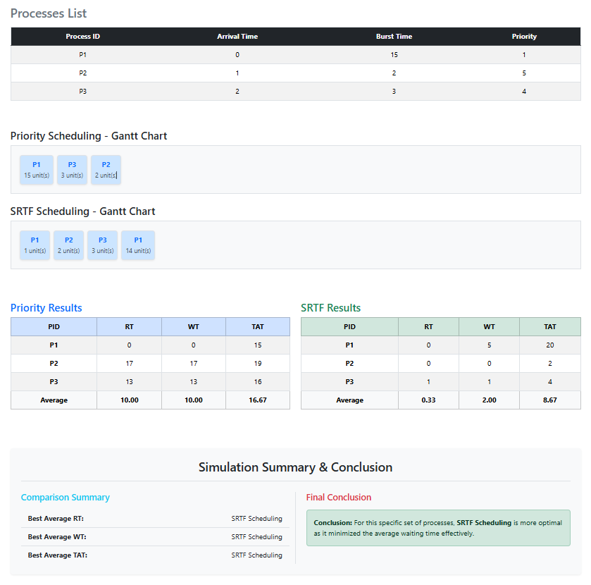

# Scenario B: High-Priority Long Job vs. Short Jobs

### 1- Overview:
This scenario investigates how the scheduler behaves when a long process with the highest priority (**P1**) arrives first, followed by shorter processes with lower priorities. It highlights the difference between prioritizing "Importance" (Priority) vs. "Shortness" (SRTF).

### 2- Input Data
Based on the simulation results, the following processes were used:

| Process | Arrival Time (AT) | Burst Time (BT) | Priority |
| :--- | :---: | :---: | :---: |
| P1 | 0 ms | 15 ms | 1 |
| P2 | 1 ms | 2 ms | 5 |
| P3 | 2 ms | 3 ms | 4 |

### 3- What Happened?

### Step 1: Arrival of P1 (Time = 0 ms)
-  T=0 ms: P1 starts immediately. Since its priority is 1 (Highest), no other arriving process can interrupt it in the Priority algorithm.

### Step 2: Arrival of P2 & P3 (Time = 1 ms & 2 ms)
- In Priority: Although P2 and P3 arrive, they stay in the Ready Queue because their priorities (5 and 4) are lower than P1 (1). No Preemption occurs.
- In SRTF: When P2 arrives at T=1, its remaining time (2ms) is much shorter than P1's remaining time (14ms). **Preemption occurs**, and P2 takes the CPU.

### Step 3: Completion & Re-scheduling
- In Priority: After P1 finishes at T=15, the scheduler picks P3 (Priority 4) then P2 (Priority 5).
- In SRTF: After P2 and P3 finish their short bursts, the CPU finally returns to finish the remainder of P1.

### 4- Manual Calculation (Sample for P1):
To verify the code results, we calculate the metrics for P1 manually:

#### In Priority Scheduling:
- Completion Time (CT): 15 ms
- Turnaround Time (TAT): 15 - 0 = 15 ms
- Waiting Time (WT): 15 - 15 = 0 ms
- Response Time (RT): 0 - 0 = 0 ms

#### In SRTF Scheduling:
- Logic:** P1 runs for 1ms, gets preempted by P2 and P3, then resumes at T=6ms to finish the remaining 14ms.
- Completion Time (CT): 20 ms
- Turnaround Time (TAT): 20 - 0 = 20 ms
- Waiting Time (WT): 20 - 15 = 5ms
- Response Time (RT): 0 - 0 = 0 ms

### 5- Detailed Results Table:

#### Priority Scheduling (Preemptive)
| Process | AT | CT | TAT (CT-AT) | WT (TAT-BT) | RT |
| :--- | :---: | :---: | :---: | :---: | :---: |
| P1 | 0 | 15 | 15 | 0 | 0 |
| P2 | 1 | 20 | 19 | 17 | 17 |
| P3 | 2 | 18 | 16 | 13 | 13 |

#### SRTF Scheduling
| Process | AT | CT | TAT (CT-AT) | WT (TAT-BT) | RT |
| :--- | :---: | :---: | :---: | :---: | :---: |
| P1 | 0 | 20 | 20 | 5 | 0 |
| P2 | 1 | 3 | 2 | 0 | 0 |
| P3 | 2 | 6 | 4 | 1 | 1 |

### 6- Results Summary (Averages):
| Metric | Priority Scheduling | SRTF Scheduling |
| :--- | :---: | :---: |
| Avg Waiting Time | 10.00 ms | 2.00 ms |
| Avg Turnaround Time | 16.67 ms | 8.67 ms |
| Avg Response Time | 10.00 ms | 0.33 ms |

### 7- Conclusion
SRTF is significantly more efficient in this scenario, reducing the Average Waiting Time from 10.00 ms to 2.00 ms. While Priority Scheduling kept P1 running because it was "important," SRTF recognized that finishing the shorter P2 and P3 first would drastically improve the overall system response time.

