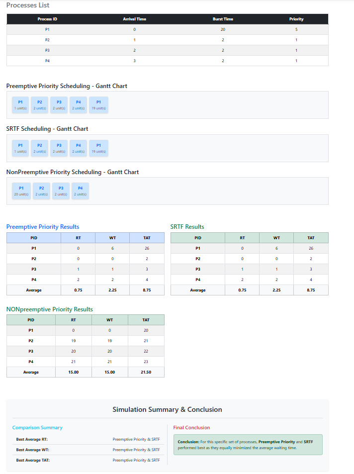

# Scenario C: Identical Behavior (Priority vs. SRTF Tie)

### 1- Overview:
This scenario demonstrates a unique case where Priority Scheduling (Preemptive) and SRTF produce the exact same results. This happens when high-priority processes are also the shortest ones in the queue.

### 2- Input Data
Based on the simulation results, the following processes were used:

| Process | Arrival Time (AT) | Burst Time (BT) | Priority |
| :--- | :---: | :---: | :---: |
| P1 | 0 ms | 20 ms | 5 |
| P2 | 1 ms | 2 ms | 1 |
| P3 | 2 ms | 2 ms | 1 |
| P4 | 3 ms | 2 ms | 1 |

### 3- What Happened?

### Step 1: Arrival of P1 (Time = 0 ms)
- At T=0 ms: P1 starts running as it is the only process.

### Step 2: Continuous Preemption (Time = 1 ms to 3 ms)
- At T=1, 2, and 3 ms:  New processes (P2, P3, P4) arrive. 
- In both algorithms: P1 is preempted because the new arrivals have both a higher priority (1 vs 5) and a shorter burst time (2ms vs 19ms).
- The CPU handles P2, then P3, then P4 in sequence.

### Step 3: Resuming the Long Task
- After all short/high-priority tasks finish at **T=7 ms**, the CPU resumes **P1** to finish its remaining 19 ms.

### 4- Manual Calculation (Sample for P1):
To verify the code results, we calculate the metrics for P1 manually:

#### In Both Algorithms (Priority & SRTF):
- Logic: P1 starts at 0, is preempted at 1, and stays in the Ready Queue while P2, P3, and P4 execute (total 6 ms). It resumes at T=7.
- Completion Time (CT): 26 ms
- Turnaround Time (TAT): 26 - 0 = 26 ms
- Waiting Time (WT): 26 - 20 = 6 ms
- Response Time (RT): 0 - 0 = 0 ms

### 5- Detailed Results Table:

#### Priority Scheduling (Preemptive)
| Process | AT | CT | TAT (CT-AT) | WT (TAT-BT) | RT |
| :--- | :---: | :---: | :---: | :---: | :---: |
| P1 | 0  | 26 | 26 | 6 | 0 |
| P2 | 1 | 3 | 2 | 0 | 0 |
| P3 | 2 | 5 | 3 | 1 | 1 |
| P4 | 3 | 7 | 4 | 2 | 2 |

#### Priority Scheduling (Non Preemptive)
| Process | AT | CT | TAT (CT-AT) | WT (TAT-BT) | RT |
| :--- | :---: | :---: | :---: | :---: | :---: |
| P1 | 0  | 20 | 20 | 0 | 0 |
| P2 | 1 | 22 | 21 | 19 | 19 |
| P3 | 2 | 24 | 22 | 20 | 20 |
| P4 | 3 | 26 | 23 | 21 | 21 |

#### SRTF Scheduling
| Process | AT | CT | TAT (CT-AT) | WT (TAT-BT) | RT |
| :--- | :---: | :---: | :---: | :---: | :---: |
| P1 | 0 | 26 | 26 | 6 | 0 |
| P2 | 1 | 3 | 2 | 0 | 0 |
| P3 | 2 | 5 | 3 | 1 | 1 |
| P4| 3 | 7 | 4 | 2 | 2 |

### 6- Results Summary (Averages):
| Metric | Preemptive Priority Scheduling | SRTF Scheduling | Non Preemptive Priority
| :--- | :---: | :---: |
| Avg Waiting Time | 2.25 ms | 2.25 ms | 15ms
| Avg Turnaround Time | 8.75 ms | 8.75 ms | 15ms
| Avg Response Time | 0.75 ms | 0.75 ms | 21.5ms

### 7- Conclusion
In this scenario, there are tie between preemptive priority and SRTF and they are best optimal. The Comparison Summary shows a "Tie" in all metrics (Waiting Time, Turnaround Time, and Response Time). This proves that when priority assignments align with task lengths, the scheduling overhead and decisions become unified.

