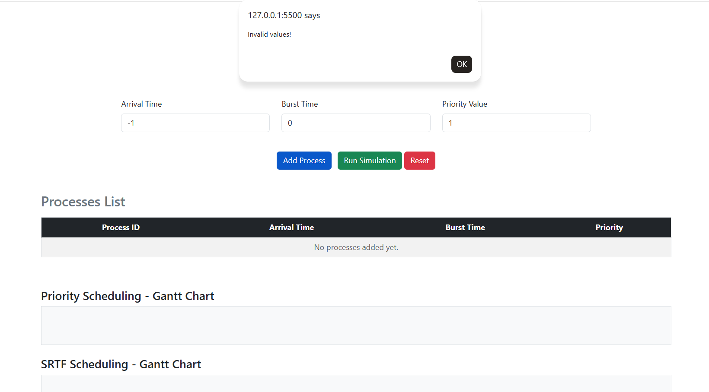

# Scenario D: Input Validation and Error Handling

### 1- Overview:
This scenario focuses on the robustness of the application. It tests how the system handles invalid inputs, such as negative arrival times or zero burst times, to ensure data integrity and prevent system crashes.

### 2- Input Data
The following invalid values were entered to test the system's validation logic:

| Process | Arrival Time (AT) | Burst Time (BT) | Priority |
| :--- | :---: | :---: | :---: |
| Invalid Entry | -1 ms | 0 ms | 1 |

---

### 3- What Happened?

### Step 1: Attempting to Add Invalid Data
-  The user attempted to add a process with an Arrival Time of -1 (which is physically impossible) and a Burst Time of 0 (which means the process has no work to do).

### Step 2: System Response (Validation Check)
-  The system's input validation layer immediately detected these logical errors.
-  A JavaScript alert pop-up was triggered displaying: "Invalid values!".

### Step 3: Prevention of Calculation
-  The system blocked the "Add Process" action.
-  The Processes List remained empty, and the Gantt Charts did not render. This prevents the scheduling algorithms from attempting to process mathematically undefined data.

### 4- Manual Calculation:
- Calculation Status: N/A (Not Applicable).
-  Since the input was rejected, no scheduling occurred, and no metrics (CT, TAT, WT, RT) were generated. This is the correct and expected behavior for error handling.

### 5- Detailed Results Table:
(Tables remain empty as the system successfully blocked the invalid input).

| Process | AT | CT | TAT | WT | RT |
| :--- | :---: | :---: | :---: | :---: | :---: |
| N/A | - | - | - | - | - |

### 6- Results Summary (Averages):
| Metric | Priority Scheduling | SRTF Scheduling |
| :--- | :---: | :---: |
| Avg Waiting Time | 0.00 ms | 0.00 ms |
| Avg Turnaround Time | 0.00 ms | 0.00 ms |
| Avg Response Time| 0.00 ms | 0.00 ms |

### 7- Conclusion
Scenario D confirms that the application has a reliable Validation Layer. By rejecting negative arrival times and zero burst times, the software demonstrates professional-grade error handling, ensuring that the scheduling simulation only runs with logically sound data.

